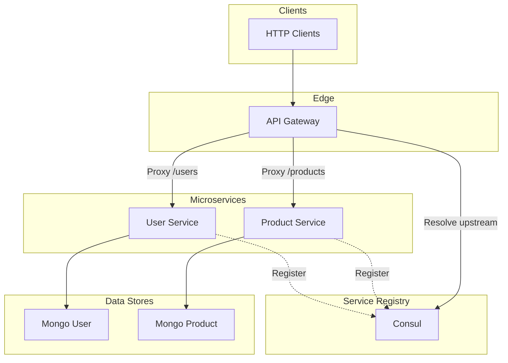
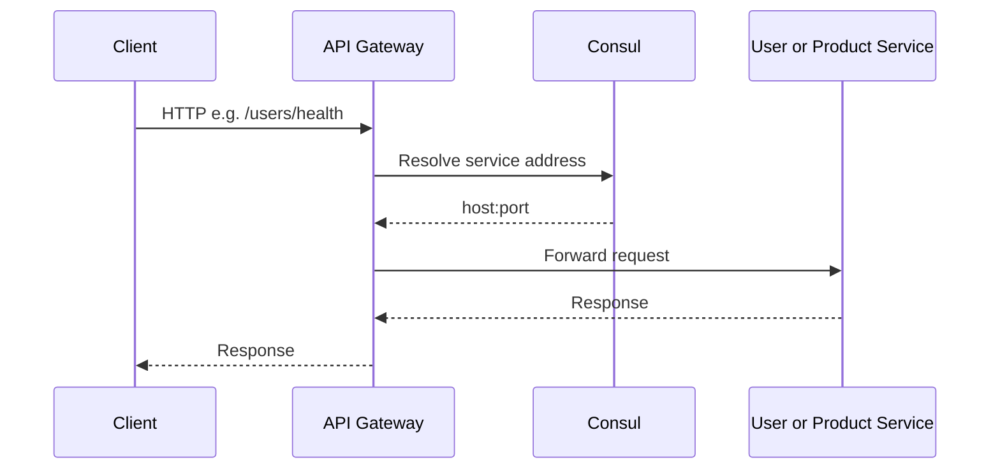

# Microservices

An Express.js monorepo that demonstrates microservices architecture: API gateway, user and product services, Consul service registry, and separate MongoDB instances per service.

## Table of Contents

- [Architecture](#architecture)
  - [Request Path](#request-path)
- [Design Decisions](#design-decisions)
- [Getting Started](#getting-started)
  - [Prerequisites](#prerequisites)
  - [Installation](#installation)
  - [Environment Configuration](#environment-configuration)
  - [Docker Development](#docker-development)
  - [Verification](#verification)
- [TODO](#todo)

## Architecture

Clients call the **API gateway**, which proxies traffic to the **user and product services**. Those services register with **Consul** at startup; the gateway resolves their addresses when forwarding requests. Each service has its own **MongoDB** instance.



### Request Path

For paths under `/users` or `/products`, the API gateway uses `http-proxy-middleware` with a router that asks Consul for the current address of `user-service` or `product-service`, then forwards the request to that target.



## Design Decisions

- **API Gateway** — Express app with `http-proxy-middleware` that forwards `/users` and `/products` to the corresponding services with round-robin load balancing.
- **User Service** — User CRUD: create (`POST /`) is unauthenticated; read, update, and delete (`GET /me`, `PUT /me`, and `DELETE /me`) require JWTs issued on login (`POST /login`). Password hashing is enforced to improve security. Tested with **Vitest**, **Supertest**, and **mongodb-memory-server**.
- **Product Service** — CRUD for products by ID. All writes (`POST /`, `PUT /:id`, and `DELETE /:id`) require JWT authentication; only read (`GET /:id`) is unauthenticated. Uses the same test stack as the User Service (**Vitest**, **Supertest**, and **mongodb-memory-server**).
- **Consul** — Each service registers on startup; the API gateway looks up upstream hosts and ports in Consul instead of using fixed hostnames.
- **Data** — A separate MongoDB database per bounded context so persistence stays loosely coupled across services.

## Getting Started

### Prerequisites

- Node.js 24
- pnpm
- Docker & Docker Compose

### Installation

```bash
pnpm install
```

### Environment Configuration

Copy `.env.example` to `.env` in repository root and each app.

```bash
cp .env.example .env
cp apps/api-gateway/.env.example apps/api-gateway/.env
cp apps/product-service/.env.example apps/product-service/.env
cp apps/user-service/.env.example apps/user-service/.env
```

Set the same **`JWT_SECRET`** in both `apps/user-service/.env` and `apps/product-service/.env` so tokens issued at login can be verified on product routes.

### Docker Development

```bash
docker compose up -d --build
```

### Verification

| App             | URL                                     |
| --------------- | --------------------------------------- |
| Consul UI       | `http://localhost:8500`                 |
| API Gateway     | `http://localhost:3000/health`          |
| User Service    | `http://localhost:3000/users/health`    |
| Product Service | `http://localhost:3000/products/health` |

## TODO

- [ ] Centralized logging
- [ ] Rate limiting
- [ ] Benchmarking and profiling
